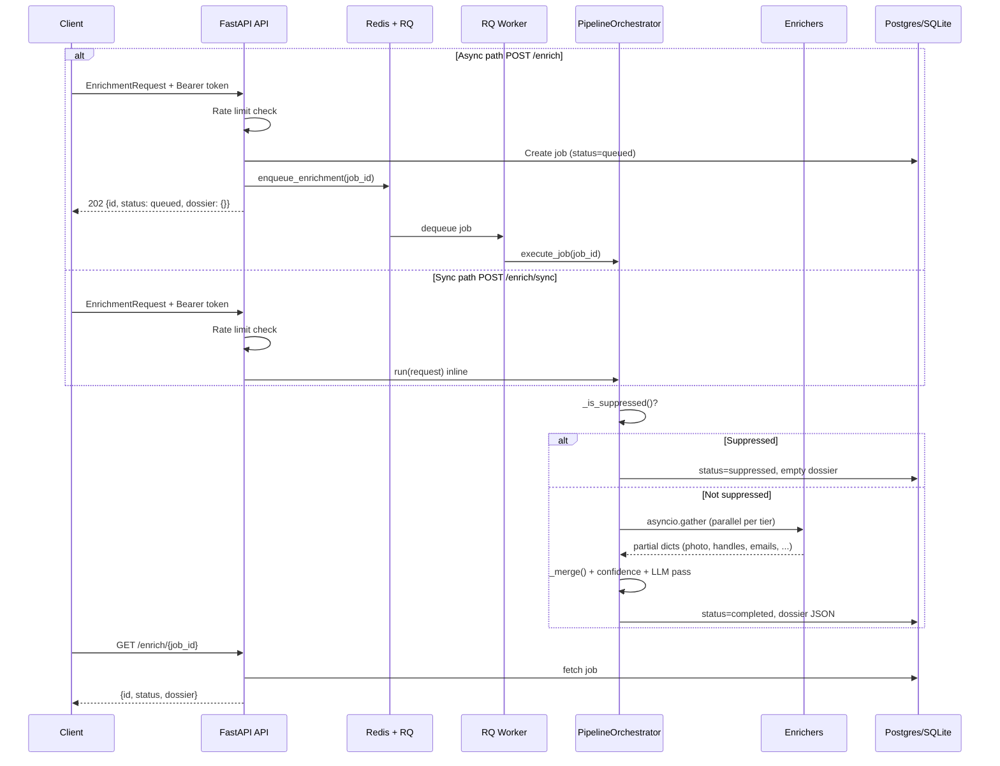

# HyerEnrichment

**Self-hosted people and company enrichment platform** — a client sends one or more identifiers (email, LinkedIn URL, username, company, business query, or job search) and receives a unified **dossier** assembled from open-source OSINT tools.

This repository is split into:

| Part | Stack | Purpose |
|------|-------|---------|
| `frontend/` | Next.js + React | Enrichment UI — intake form, pipeline view, dossier display |
| `backend/` | Python + FastAPI | REST API, pipeline orchestration, enricher plugins, storage |

The customer owns the code and the data. Everything runs on infrastructure you control.

---

## Table of contents

1. [What this project does](#what-this-project-does)
2. [Features built today](#features-built-today)
3. [Architecture overview](#architecture-overview)
4. [Data flow](#data-flow)
5. [Enrichment tiers](#enrichment-tiers)
6. [Services and sidecars](#services-and-sidecars)
7. [API reference](#api-reference)
8. [Frontend](#frontend)
9. [Folder structure](#folder-structure)
10. [Getting started](#getting-started)
11. [Configuration](#configuration)
12. [Testing](#testing)
13. [Implementation status](#implementation-status)
14. [What needs to be done](#what-needs-to-be-done)
15. [Related documentation](#related-documentation)

---

## What this project does

Hyrepath Enrichment answers: *"Given what I already know about a person or company, what else can I learn from public sources?"*

A typical dossier may include:

- LinkedIn profile photo (cached to object storage)
- Cross-site social handles (GitHub, X, Reddit, and thousands more)
- Public commit emails and GitHub metadata
- Guessed and SMTP-verified corporate emails
- Coworkers at the same company
- Open job posts across multiple boards
- Local business info (address, phone, rating)

**Product boundaries (enforced by design):**

- Public data only — no private sources, face recognition, or bulk scraping
- Customer-supplied identifiers only — no unsolicited people-finding
- Opt-out is permanent — suppressed identifiers return an empty dossier
- AGPL tools run as isolated HTTP sidecars — never imported into application code

---

## Features built today

### Backend

| Area | Status |
|------|--------|
| FastAPI app with Bearer token auth | Done |
| Async job queue (`POST /enrich` → Redis + RQ → worker) | Done |
| Sync enrichment path (`POST /enrich/sync`) | Done |
| Job polling (`GET /enrich/{id}`) | Done |
| 11 enricher modules across 4 tiers | Done (degrade gracefully when tools absent) |
| Provider layer (`app/providers/`) — free/paid mode switches | Done |
| Pipeline orchestrator with merge + confidence scoring | Done |
| LLM disambiguation for low-confidence handles | Done (stub default; ollama/litellm opt-in) |
| Opt-out / suppression (SQL + Redis dual-write) | Done |
| Rate limiting per API token (Redis) | Done |
| Health, readiness, Prometheus metrics endpoints | Done |
| Change-detection webhook consumer | Done |
| Docker Compose (API, worker, Postgres, Redis, sidecars) | Done |
| SQLite local dev / Postgres in Docker | Done |

### Frontend

| Area | Status |
|------|--------|
| Identifier intake (email, LinkedIn, username, company, business, job search) | Done |
| Tier selection (`tier1`–`tier4`) | Done |
| Pipeline visualization | Done |
| Merged dossier presentation | Done |
| Next.js API route proxying to backend `/enrich/sync` | Done |

---

## Architecture overview

The backend is a **modular monolith** with clear layers:

```
┌─────────────────────────────────────────────────────────────────────────┐
│  Client (frontend, ATS, curl, etc.)                                     │
└───────────────────────────────┬─────────────────────────────────────────┘
                                │ HTTP + Bearer token
                                ▼
┌─────────────────────────────────────────────────────────────────────────┐
│  FastAPI (app/main.py)                                                  │
│  ├── routes/enrich.py      POST /enrich, /enrich/sync, GET /enrich/{id} │
│  ├── routes/opt_out.py     POST /api/opt-out, GET /api/opt-out/check    │
│  ├── routes/health.py      GET /health, /ready, /metrics                │
│  └── routes/signals.py     POST /api/signals/changedetection          │
└───────────────────────────────┬─────────────────────────────────────────┘
                                │
              ┌─────────────────┴─────────────────┐
              │ async path                        │ sync path
              ▼                                   ▼
     ┌─────────────────┐              ┌──────────────────────┐
     │ Redis + RQ queue │              │ PipelineOrchestrator │
     │ (app/workers/)   │              │ (inline in API proc) │
     └────────┬─────────┘              └──────────┬───────────┘
              │ dequeue                           │
              ▼                                   │
     ┌─────────────────┐                           │
     │ RQ worker       │───────────────────────────┘
     │ (rq_worker.py)  │
     └────────┬────────┘
              ▼
┌─────────────────────────────────────────────────────────────────────────┐
│  PipelineOrchestrator (app/workers/runner.py)                           │
│  1. Suppression check (opt-out)                                         │
│  2. Dispatch enrichers for requested tiers (parallel)                   │
│  3. Merge partial results → canonical Dossier                             │
│  4. Confidence scoring + LLM disambiguation                             │
│  5. Persist job + dossier JSON                                            │
└───────────────────────────────┬─────────────────────────────────────────┘
                                │
        ┌───────────────────────┼───────────────────────┐
        ▼                       ▼                       ▼
┌───────────────┐     ┌─────────────────┐     ┌─────────────────┐
│ Enrichers     │     │ Providers       │     │ Storage         │
│ (11 modules)  │────▶│ (free/paid      │     │ SQLite/Postgres │
│               │     │  backends)      │     │ Redis           │
│               │     │                 │     │ R2 / .asset-cache│
└───────────────┘     └─────────────────┘     └─────────────────┘
                                │
                                ▼
                    ┌───────────────────────┐
                    │ HTTP sidecars         │
                    │ (AGPL isolated)       │
                    │ social-analyzer       │
                    │ google-maps-scraper   │
                    │ reacher (opt-in)      │
                    └───────────────────────┘
```

### Layer responsibilities

| Layer | Location | Role |
|-------|----------|------|
| Routes | `backend/app/routes/` | HTTP surface, auth, rate limits, request/response models |
| Services | `backend/app/services.py` | Factory for `PipelineOrchestrator` |
| Orchestrator | `backend/app/workers/runner.py` | Suppression, tier dispatch, merge, confidence |
| Enrichers | `backend/app/enrichers/` | One module per upstream OSINT tool |
| Providers | `backend/app/providers/` | Config-selected backends (browser, proxy, LLM, email verify, sidecar HTTP, subprocess) |
| Storage | `backend/app/storage/` | Async SQLAlchemy, Redis client, R2 asset client |
| LLM router | `backend/app/llm_router.py` | Disambiguation for handles below confidence threshold |
| Models | `backend/app/models.py` | Pydantic schemas + SQLAlchemy tables |
| Config | `backend/app/config.py` | All environment-driven settings |

---

## Data flow

### End-to-end request lifecycle



### Step-by-step (code path)

1. Request hits `app/routes/enrich.py`
2. `verify_token` dependency checks `Authorization: Bearer <API_TOKEN>`
3. Rate-limit dependency enforces per-token limits (`429` when exceeded)
4. `EnrichmentRequest` validates at least one identifier is present
5. **Async (`POST /enrich`):** job persisted as `queued` → pushed to RQ `enrichment` queue → returns `202`. If Redis is down → job marked `failed`, returns `503`.
6. **Sync (`POST /enrich/sync`):** `PipelineOrchestrator.run()` executes inline in the API process.
7. **Worker:** `rq_worker.py` dequeues → `execute_job()` → shared `_execute()` logic.
8. `_execute()` checks suppression → dispatches enrichers → merges → persists.
9. Client polls `GET /enrich/{job_id}` until `completed`, `failed`, or `suppressed`.

**Cross-process note:** async polling only works when API and worker share the same database. Docker Compose wires both to Postgres. Local dev with SQLite works when both processes use the same working directory.

### Enricher lifecycle (per enricher in `_dispatch`)

1. `validate()` — skip if required identifier missing
2. `initialize()` → `run()` → `normalize()` → `score()`
3. `cleanup()` in a `finally` block
4. Returns a partial dict; orchestrator merges all partials into one `Dossier`

Each enricher **degrades to an empty fragment** when its tool, sidecar, or API key is missing — the pipeline never crashes on a missing dependency.

---

## Enrichment tiers

The orchestrator registers enrichers in `PipelineOrchestrator.__init__` (`backend/app/workers/runner.py`).

### Tier 1 — LinkedIn photo (browser-based)

| Module | Upstream tool | Integration |
|--------|---------------|-------------|
| `linkedin_photo.py` | `joeyism/linkedin_scraper` + Playwright | Browser via `BrowserProvider`; photo uploaded to R2 |

- Gated by `ENABLE_TIER1=false` by default (hardest to run free)
- One browser session per profile — no bulk scraping
- Multilogin X stealth browser available via `BROWSER_MODE=multilogin`

### Tier 2 — Cross-site username hunt (no browser)

Runs in parallel when `tier2` is requested:

| Module | Upstream | Confidence base |
|--------|----------|-----------------|
| `sherlock.py` | `sherlock-project/sherlock` (MIT) | ~0.75 |
| `maigret.py` | `soxoj/maigret` (MIT) | ~0.85 |
| `social_analyzer.py` | `qeeqbox/social-analyzer` (AGPL) | NLP scoring via HTTP sidecar |

Handles below **0.7** confidence go to the LLM disambiguator.

### Tier 3 — Deep OSINT (GitHub + email + company)

| Module | Upstream | Role |
|--------|----------|------|
| `gitrecon.py` | `GONZOsint/gitrecon` | Commit emails, names, orgs from GitHub |
| `theharvester.py` | `laramies/theHarvester` | Company-wide email harvest |
| `email_discover.py` | `buyukakyuz/email-sleuth` | Pattern-guess corporate emails |
| `email_verify.py` | Reacher + AfterShip + mailchecker | SMTP verify, catch-all, disposable blocklist |
| `crosslinked.py` | `m8sec/CrossLinked` | Coworker enumeration without LinkedIn login |

### Tier 4 — Job match + local business

| Module | Upstream | Role |
|--------|----------|------|
| `jobspy.py` | `speedyapply/JobSpy` | Multi-board job pull |
| `local_business.py` | `gosom/google-maps-scraper` | Address, phone, website, rating via sidecar |

### LLM post-pass

`app/llm_router.py` resolves ambiguous handles (confidence &lt; `DISAMBIGUATION_THRESHOLD`, default `0.7`).

Mode selected via `LLM_MODE`:

| Mode | Behavior |
|------|----------|
| `stub` (default) | Heuristic string match, no network |
| `ollama` | Local model via Ollama sidecar |
| `litellm` | LiteLLM proxy with fallback chain |

---

## Services and sidecars

### Docker Compose topology

File: `backend/docker/docker-compose.yml`

| Service | Port | Role | Default on? |
|---------|------|------|-------------|
| `api` | 8000 | FastAPI HTTP server | Yes |
| `worker` | — | RQ worker running orchestrator | Yes |
| `postgres` | 5432 | Job + suppression persistence | Yes |
| `redis` | 6379 | Queue, suppression cache, rate limits | Yes |
| `social-analyzer` | 9005 | AGPL sidecar for Tier 2 NLP scoring | Yes |
| `google-maps-scraper` | 8080 | Tier 4 local business lookup | Yes |
| `reacher` | — | SMTP email verification (Tier 3) | Profile: `paid` |
| `litellm` | 4000 | LLM proxy | Profile: `llm`, `paid` |
| `ollama` | 11434 | Local LLM | Profile: `llm` |
| `scrapoxy` | — | Proxy pool for rate-limit hardening | Profile: `paid` |
| `langfuse` | 3000 | LLM observability | Profile: `observability` |
| `glitchtip-web` | 8001 | Central error tracking (Sentry-compatible) | Profile: `observability` |
| `changedetection` | — | Company change monitoring | Profile: `observability` |

Start the default free stack:

```bash
cd backend/docker
docker compose up --build api worker redis postgres social-analyzer google-maps-scraper
```

Start paid/observability services with profiles:

```bash
docker compose --profile paid --profile llm up
```

### Provider mode switches

Five env flags in `config.py` control free vs paid backends. Enrichers never know which backend is active:

| Flag | Default | Options |
|------|---------|---------|
| `PROXY_MODE` | `none` | `none`, `scrapoxy`, `paid` |
| `BROWSER_MODE` | `local` | `local`, `multilogin` |
| `LLM_MODE` | `stub` | `stub`, `ollama`, `litellm` |
| `EMAIL_VERIFY_LEVEL` | `basic` | `basic` (syntax+MX), `smtp` (Reacher) |
| `ENABLE_TIER1` | `false` | `true` / `false` |

### How enrichers reach sidecars

```
Enricher module
    └── app/providers/sidecar.py (SidecarClient)
            └── HTTP POST/GET to sidecar URL
                    e.g. SOCIAL_ANALYZER_URL=http://social-analyzer:9005
                         GMAPS_SCRAPER_URL=http://google-maps-scraper:8080
                         REACHER_URL=http://reacher:8080
```

Subprocess-based enrichers use `app/providers/process.py` (`run_command`). Browser work uses `app/providers/browser.py`. Email verification uses `app/providers/email_verify.py`.

---

## API reference

**Base URL:** `http://localhost:8000` (local)  
**Auth:** `Authorization: Bearer <API_TOKEN>` on all routes except health endpoints and the signals webhook.

### `GET /health`

Liveness probe. No auth required.

**Response `200`:**
```json
{
  "status": "ok",
  "service": "Hyrepath Enrichment Backend"
}
```

### `GET /ready`

Readiness probe. No auth required.

**Response `200`:**
```json
{
  "status": "ready",
  "service": "Hyrepath Enrichment Backend"
}
```

### `GET /metrics`

Prometheus metrics (empty body if `prometheus_client` not installed). No auth required.

---

### `POST /enrich`

Create an async enrichment job. Returns immediately; poll `GET /enrich/{id}` for results.

**Auth:** Required  
**Rate limit:** `MAX_ASYNC_REQUESTS_PER_MINUTE` (default 30/min per token)

**Request body:**
```json
{
  "email": "jane@acme.com",
  "linkedin_url": "https://www.linkedin.com/in/jane-doe",
  "username": "jane-doe",
  "company": "Acme",
  "business": "Acme Coffee Curitiba",
  "job_search": "senior backend engineer remote",
  "requested_tiers": ["tier1", "tier2", "tier3", "tier4"]
}
```

At least one identifier field is required. `requested_tiers` defaults to all four tiers.

**Response `202`:**
```json
{
  "id": "job_abc123def456",
  "status": "queued",
  "dossier": {}
}
```

**Errors:**

| Status | When |
|--------|------|
| `401` | Missing or invalid Bearer token |
| `422` | No identifier provided |
| `429` | Rate limit exceeded |
| `503` | Redis queue unavailable |

---

### `GET /enrich/{job_id}`

Poll job status and retrieve dossier.

**Auth:** Required

**Response `200`:**
```json
{
  "id": "job_abc123def456",
  "status": "completed",
  "dossier": {
    "photo": {
      "source": "linkedin-photo",
      "asset_url": "https://cdn.example.com/linkedin_jane-doe.jpg",
      "captured_at": "2026-07-08T12:00:00Z",
      "confidence": 0.84
    },
    "handles": [
      {
        "platform": "X",
        "username": "jane-doe",
        "profile_url": "https://x.com/jane-doe",
        "confidence": 0.75,
        "metadata": {}
      }
    ],
    "emails": ["jane@acme.com"],
    "verified_emails": [
      {
        "value": "jane.doe@acme.com",
        "status": "verified",
        "confidence": 0.89,
        "source": "reacher"
      }
    ],
    "github": {
      "profile": "jane-doe",
      "organizations": ["acme"],
      "public_commits": 142
    },
    "coworkers": ["bob@acme.com"],
    "jobs": [
      {
        "title": "Senior Backend Engineer",
        "company": "Acme",
        "location": "Remote",
        "remote": true,
        "source": "linkedin"
      }
    ],
    "business": {
      "name": "Acme Coffee",
      "address": "123 Main St",
      "website": "https://acmecoffee.com",
      "rating": 4.5,
      "phone": "+1-555-0100",
      "metadata": {}
    },
    "confidence": [
      {
        "label": "identity-match",
        "score": 0.91,
        "evidence": []
      }
    ],
    "sources": ["Sherlock", "gitrecon"],
    "metadata": {
      "requested_tiers": ["tier2", "tier3"],
      "identifier_summary": "username=jane-doe"
    }
  }
}
```

**Job statuses:** `queued` → `running` → `completed` | `failed` | `suppressed`

**Errors:**

| Status | When |
|--------|------|
| `401` | Invalid token |
| `404` | Job not found |

---

### `POST /enrich/sync`

Run enrichment inline in the API process. Same request body as `POST /enrich`.

**Auth:** Required  
**Rate limit:** `MAX_SYNC_REQUESTS_PER_MINUTE` (default 10/min per token)

**Response `200`:** Same shape as `GET /enrich/{id}` with `status: "completed"` (or `"suppressed"`).

---

### `POST /api/opt-out`

Register an identifier for permanent suppression (LGPD/GDPR/CCPA).

**Auth:** Required (intentional v1 — public form proxies via frontend; see `backend/docs/LEGAL.md`)

**Side effects:** Registers suppression, writes audit events, and purges matching job dossiers / photo cache / R2 objects.

**Request body:**
```json
{
  "identifier": "jane@acme.com",
  "reason": "data subject request"
}
```

**Response `202`:**
```json
{
  "status": "accepted"
}
```

The identifier is stored as SHA-256 hash in `suppression_list` (SQL) and `suppression:hashes` (Redis).

---

### `GET /api/opt-out/check?identifier=...`

Check whether an identifier is suppressed.

**Auth:** Required

**Response `200`:**
```json
{
  "identifier": "jane@acme.com",
  "suppressed": true
}
```

---

### `POST /api/dsar`

Create a data subject access or deletion request (processed immediately in v1).

**Auth:** Required

**Request body:**
```json
{
  "identifier": "jane@acme.com",
  "request_type": "access",
  "notes": "optional"
}
```

`request_type` is `access` or `deletion`. Deletion runs the same suppression + purge path as opt-out.

**Response `201`:** DSAR id, status, and summary (counts only — no dossier PII).

---

### `GET /api/dsar/{id}`

Poll DSAR status and summary.

**Auth:** Required

---

### `POST /api/signals/changedetection`

Webhook consumer for [changedetection.io](https://changedetection.io) change notifications.

**Auth:** Optional shared secret via `X-Signal-Token` header (set `CHANGEDETECTION_API_KEY`)

**Request body:** changedetection.io webhook payload (arbitrary JSON)

**Response `202`:**
```json
{
  "status": "accepted"
}
```

---

## Frontend

The Next.js app under `frontend/` provides the enrichment experience UI.

### Pages and components

| File | Purpose |
|------|---------|
| `app/page.tsx` | Main page — wires intake, pipeline, and dossier views |
| `app/layout.tsx` | Root layout and global styles |
| `app/api/enrich/route.ts` | Server-side proxy to backend `POST /enrich/sync` |
| `components/IntakeForm.tsx` | Identifier input + tier selection + submit |
| `components/PipelineOverview.tsx` | Visual pipeline trace for the current job |
| `components/DossierView.tsx` | Renders merged dossier fields |
| `components/HeroPanel.tsx` | Hero section with tier summary |

### Data layer

| File | Purpose |
|------|---------|
| `src/lib/types.ts` | Frontend TypeScript types (`Dossier`, `EnrichmentInput`, etc.) |
| `src/lib/api-adapter.ts` | Maps snake_case backend ↔ camelCase frontend |
| `src/lib/utils.ts` | Shared utilities |
| `src/lib/mock-data.ts` | Mock dossier for development |

**Important:** Backend uses `linkedin_url`; frontend uses `linkedinUrl`. All field mapping goes through `api-adapter.ts` — do not map in components.

### Frontend environment

Copy `frontend/.env.example` → `frontend/.env.local`:

```
BACKEND_API_URL=http://localhost:8000
BACKEND_API_TOKEN=change-me
```

### Run frontend

```bash
cd frontend
npm install
npm run dev
# → http://localhost:3000
```

---

## Folder structure

```text
HyerEnrichment/
├── README.md                          # This file — developer onboarding
├── CHANGELOG.md                       # Ticket-level release notes
├── RULE.md                            # Development rules (reuse, architecture, safety)
├── AGENTS.md                          # Agent session behavior
│
├── frontend/                          # Next.js enrichment UI
│   ├── app/
│   │   ├── page.tsx                   # Main enrichment page
│   │   ├── layout.tsx                 # Root layout
│   │   ├── globals.css                # Global styles
│   │   └── api/enrich/route.ts        # BFF proxy to backend
│   ├── components/
│   │   ├── IntakeForm.tsx             # Identifier + tier intake
│   │   ├── PipelineOverview.tsx       # Pipeline visualization
│   │   ├── DossierView.tsx            # Dossier display
│   │   └── HeroPanel.tsx              # Hero section
│   ├── src/lib/
│   │   ├── types.ts                   # Frontend TypeScript types
│   │   ├── api-adapter.ts           # Backend ↔ frontend field mapping
│   │   ├── utils.ts                   # Utilities
│   │   └── mock-data.ts               # Dev mock data
│   ├── package.json
│   └── .env.example
│
├── backend/
│   ├── app/
│   │   ├── main.py                    # FastAPI entrypoint, auth, lifespan, route registration
│   │   ├── config.py                  # All env-driven settings (Settings class)
│   │   ├── models.py                  # Pydantic schemas + SQLAlchemy ORM models
│   │   ├── services.py                # get_orchestrator() factory
│   │   ├── multilogin.py              # Multilogin X API client (Tier 1)
│   │   ├── llm_router.py              # LiteLLMDisambiguator for handle disambiguation
│   │   │
│   │   ├── routes/
│   │   │   ├── enrich.py              # POST /enrich, /enrich/sync, GET /enrich/{id}
│   │   │   ├── opt_out.py             # POST /api/opt-out, GET /api/opt-out/check
│   │   │   ├── health.py              # GET /health, /ready, /metrics
│   │   │   ├── signals.py             # POST /api/signals/changedetection
│   │   │   └── rate_limit.py          # Redis fixed-window rate limit dependencies
│   │   │
│   │   ├── enrichers/                 # One module per OSINT tool
│   │   │   ├── base.py                # Enricher ABC + graceful degradation wrapper
│   │   │   ├── _shared.py             # Shared enricher helpers
│   │   │   ├── linkedin_photo.py      # Tier 1 — LinkedIn photo
│   │   │   ├── sherlock.py            # Tier 2 — username search
│   │   │   ├── maigret.py             # Tier 2 — username search (deeper)
│   │   │   ├── social_analyzer.py     # Tier 2 — NLP scoring (sidecar)
│   │   │   ├── gitrecon.py            # Tier 3 — GitHub commit emails
│   │   │   ├── theharvester.py        # Tier 3 — company email harvest
│   │   │   ├── email_discover.py      # Tier 3 — email pattern guessing
│   │   │   ├── email_verify.py        # Tier 3 — SMTP verification
│   │   │   ├── crosslinked.py         # Tier 3 — coworker enumeration
│   │   │   ├── jobspy.py              # Tier 4 — multi-board job search
│   │   │   └── local_business.py      # Tier 4 — Google Maps (sidecar)
│   │   │
│   │   ├── providers/                 # Config-selected free/paid backends
│   │   │   ├── browser.py             # Playwright / Multilogin browser sessions
│   │   │   ├── proxy.py               # Scrapoxy / paid proxy pool
│   │   │   ├── llm.py                 # stub / ollama / litellm backends
│   │   │   ├── email_verify.py        # basic (syntax+MX) / smtp (Reacher)
│   │   │   ├── sidecar.py             # HTTP client for isolated sidecar services
│   │   │   └── process.py             # Subprocess runner for CLI tools
│   │   │
│   │   ├── storage/
│   │   │   ├── db.py                  # Async SQLAlchemy engine + session + init_db()
│   │   │   ├── redis_client.py        # Shared async Redis client
│   │   │   └── r2.py                  # R2 / local .asset-cache asset uploads
│   │   │
│   │   └── workers/
│   │       ├── runner.py              # PipelineOrchestrator — core pipeline logic
│   │       ├── queue.py               # RQ enqueue helper
│   │       ├── jobs.py                # RQ job function (bridges sync→async)
│   │       └── rq_worker.py           # RQ worker entrypoint
│   │
│   ├── docker/
│   │   ├── docker-compose.yml         # Full service topology
│   │   ├── Dockerfile.api             # API container
│   │   ├── Dockerfile.worker          # Worker container
│   │   └── Dockerfile.social-analyzer # Custom social-analyzer sidecar image
│   │
│   ├── docs/
│   │   └── ARCHITECTURE.md            # Detailed backend architecture reference
│   │
│   ├── load/
│   │   └── k6/main.js                 # k6 load scenarios (make load-test)
│   │
│   ├── scripts/
│   │   ├── smoke_test.py              # Quick health check
│   │   ├── run_load_test.py           # k6 load harness driver
│   │   ├── e2e_compose_test.sh        # Docker Compose E2E test
│   │   ├── e2e_realworld_strict.py    # Real-world enrichment E2E
│   │   ├── probe_enrichers.py         # Tier 2–4 isolation probe
│   │   └── probe_*.sh                 # Sidecar health probes
│   │
│   ├── tests/
│   │   ├── test_pipeline_shape.py     # Enricher output shape tests
│   │   ├── test_enrichers.py          # Enricher unit tests
│   │   └── test_db.py                 # Database tests
│   │
│   ├── .env.example                   # All environment variables documented
│   ├── pyproject.toml                 # Python package + dependencies
│   └── README.md                      # Backend run/test quick reference
│
└── docs/                              # Ticket handoff and planning docs
    ├── IMPLEMENTATION_NOTES.md
    └── architecture-plan-azi-10-hyre-enrichment.md
```

### Database tables

| Table | Columns | Purpose |
|-------|---------|---------|
| `jobs` | `id`, `status`, `request_payload` (JSON), `dossier_payload` (JSON), timestamps | Enrichment job records |
| `suppression_list` | `identifier_hash` (SHA-256), `reason`, `created_at` | Opt-out durable store |

Schema created by `init_db()` via **Alembic** (`upgrade head`; auto-stamps pre-Alembic DBs). Document columns are JSONB on Postgres / JSON on SQLite (`JsonDoc`).

---

## Getting started

Use the root **Makefile** for the common path:

```bash
make setup   # backend/.env (if missing) + backend/.venv + pip install -e ".[dev]"
make up      # free Docker stack in background (Postgres, Redis, API, worker, sidecars)
make smoke   # health + auth + sync enrich via backend/scripts/smoke_test.py
```

Other targets: `make down`, `make test`, `make migrate`, `make help`.

### Prerequisites

- Python 3.12+ (creates `backend/.venv` — required on PEP 668 / externally-managed systems)
- Node.js 18+ (frontend)
- Redis (for async queue and rate limits)
- Docker + Docker Compose (recommended for full stack)
- GNU Make (for the targets above)

### Backend — local (SQLite)

```bash
make setup

# Or manually:
cd backend
cp .env.example .env
python3 -m venv .venv
.venv/bin/pip install -e ".[dev]"
.venv/bin/pip install requests

# Terminal 1 — API
uvicorn app.main:app --reload

# Terminal 2 — RQ worker (required for async /enrich)
python -m app.workers.rq_worker
```

API: `http://localhost:8000`  
Interactive docs: `http://localhost:8000/docs`

### Backend — Docker Compose (Postgres + Redis + sidecars)

```bash
make up
# equivalent:
# cd backend/docker && docker compose up --build api worker redis postgres social-analyzer google-maps-scraper
```

Quick test:

```bash
make smoke
# or:
curl http://localhost:8000/health

curl -X POST http://localhost:8000/enrich/sync \
  -H "Authorization: Bearer change-me" \
  -H "Content-Type: application/json" \
  -d '{"username": "jane-doe", "requested_tiers": ["tier2"]}'
```

### Frontend

```bash
cd frontend
cp .env.example .env.local
npm install
npm run dev
```

UI: `http://localhost:3000`

### Central error tracking (GlitchTip)

Self-hosted Sentry-compatible dashboard for production crashes. SDK is no-op until `SENTRY_DSN` is set.

```bash
cd backend/docker
docker compose --env-file ../.env --profile observability up -d glitchtip-web glitchtip-worker
# UI → http://localhost:8001 — create project, copy DSN to backend/.env
```

E2E proof: `bash backend/scripts/e2e_error_tracking.sh`

### Install OSINT CLI tools (optional, for real enricher output)

Enrichers degrade gracefully without these, but for real data you need the upstream binaries on `PATH` or configured via env vars:

| Tool | Used by | Install |
|------|---------|---------|
| `sherlock` | `sherlock.py` | `pip install sherlock-project` |
| `maigret` | `maigret.py` | `pip install maigret` |
| `email-sleuth` | `email_discover.py` | Rust binary, set `EMAIL_SLEUTH_BIN` |
| `theHarvester` | `theharvester.py` | `pip install theHarvester` |
| `crosslinked` | `crosslinked.py` | `pip install crosslinked` |
| `python-jobspy` | `jobspy.py` | `pip install python-jobspy` |

Sidecars (`social-analyzer`, `google-maps-scraper`) are started via Docker Compose.

---

## Configuration

Copy `backend/.env.example` → `backend/.env`.

### Required

| Variable | Default | Purpose |
|----------|---------|---------|
| `API_TOKEN` | `change-me` | Bearer token for protected routes |
| `DATABASE_URL` | `sqlite+aiosqlite:///./hyrepath.db` | Async DB connection |
| `REDIS_URL` | `redis://localhost:6379/0` | Queue, suppression, rate limits |
| `R2_BUCKET` | `hyrepath-assets` | Object storage bucket name |
| `R2_PUBLIC_BASE_URL` | `https://cdn.example.com` | CDN base for cached photos |

### Provider mode switches

| Variable | Default | Purpose |
|----------|---------|---------|
| `PROXY_MODE` | `none` | Proxy backend selection |
| `BROWSER_MODE` | `local` | Browser backend for Tier 1 |
| `LLM_MODE` | `stub` | LLM disambiguation backend |
| `EMAIL_VERIFY_LEVEL` | `basic` | Email verification depth |
| `ENABLE_TIER1` | `false` | Enable LinkedIn photo tier |

### Rate limits

| Variable | Default |
|----------|---------|
| `MAX_SYNC_REQUESTS_PER_MINUTE` | 10 |
| `MAX_ASYNC_REQUESTS_PER_MINUTE` | 30 |

See `backend/.env.example` for the full list including sidecar URLs, timeouts, LLM config, and observability keys.

---

## Testing

### Dependency security audit

Automated checks for known high/critical CVEs in Python and npm dependencies:

```bash
make audit              # pip-audit (backend dev + enrichers) + npm audit (frontend)
make audit-python       # Python only
make audit-frontend     # Frontend only
```

CI runs the same checks in the `dependency-audit` job on every PR. Dependabot opens weekly upgrade PRs for pip (`backend/`), npm (`frontend/`), and GitHub Actions.

See [`docs/DEPENDENCY_AUDIT_VERIFICATION.md`](docs/DEPENDENCY_AUDIT_VERIFICATION.md) for verification evidence and known limitations (Docker sidecar clones are out of scope).

### Backend

```bash
cd backend
pytest tests
```

| Test file | What it covers |
|-----------|----------------|
| `test_pipeline_shape.py` | Every enricher returns valid dossier fragment keys |
| `test_enrichers.py` | Enricher-specific unit tests |
| `test_db.py` | Database session and schema |

### Tier 2–4 enricher debugging

See [`backend/docs/TESTING_TIER234.md`](backend/docs/TESTING_TIER234.md) for the layered checklist (prerequisites → sidecars → isolation → API).

```bash
cd backend
python scripts/probe_enrichers.py              # run each enricher in isolation
python scripts/probe_enrichers.py --prereqs    # audit CLIs and env vars only
python scripts/e2e_realworld_strict.py         # strict pass/fail against live sidecars
```

Check `dossier.sources` in API responses — missing source names mean that enricher returned empty (silent failure).

### Docker Compose E2E

```bash
bash backend/scripts/e2e_compose_test.sh
```

Proves: health check → async enrich → poll completed → opt-out suppression → worker restart persistence.

### Load / performance (k6)

```bash
make load-test
# LOAD_PROFILE=full make load-test
```

Concurrent traffic against `/health`, `/ready`, async `/enrich` + poll, and light `/enrich/sync`. Uses fake sidecars and elevated rate limits — see [`backend/docs/LOAD_TESTING.md`](backend/docs/LOAD_TESTING.md).

### Frontend

```bash
cd frontend
npm run build
npm run lint
npm run typecheck
```

---

## Implementation status

| Area | Target | Current |
|------|--------|---------|
| API routes + Bearer auth | FastAPI + Bearer | **Done** |
| Async job queue (Redis + RQ) | Worker process | **Done** |
| Orchestrator + tier dispatch | `runner.py` | **Done** |
| 11 enricher modules | Real tool integrations | **Done** — degrade to empty fragments when absent |
| Provider layer | Config-selected backends | **Done** — `app/providers/` |
| Redis (suppression, rate limits, queue) | All three roles | **Done** |
| Database | PostgreSQL + JSONB | Postgres in Docker; SQLite local; **Alembic** + `JsonDoc` (JSONB/JSON) |
| R2 photo cache | Cloudflare R2 via aioboto3 | Local `.asset-cache/` fallback |
| Multilogin + Playwright | CDP stealth browser | `BrowserProvider`; Tier 1 off by default |
| LiteLLM disambiguation | Routed LLM calls | Opt-in via `LLM_MODE` |
| Langfuse tracing | Per disambiguation call | No-op until `LANGFUSE_*` set |
| Sidecars | Isolated Docker services | Real images; free default-on, paid behind profiles |
| Opt-out auth | Unauthenticated POST | **Authenticated (intentional v1)** — see `backend/docs/LEGAL.md` |
| Audit logs | SQL + 5-year retention | **Done** |
| DSAR flow | `POST/GET /api/dsar` | **Done** |
| Data erasure | Purge on opt-out/DSAR deletion | **Done** |
| Prometheus metrics | `/metrics` | Optional dependency |
| Change signals | changedetection.io webhook | **Done** — `POST /api/signals/changedetection` |

For the authoritative per-area breakdown, see **Implementation status** in [`backend/docs/ARCHITECTURE.md`](backend/docs/ARCHITECTURE.md).

---

## What needs to be done

Priority next slices (from architecture planning):

1. **Unauthenticated opt-out/DSAR** — remove Bearer auth when senior approves (see `backend/docs/LEGAL.md`)
2. ~~**Alembic migrations** — Replace `create_all` with versioned schema migrations; promote `JSON` → `JSONB` in Postgres~~ (done)
3. **Real R2 uploads** — Wire `aioboto3` to Cloudflare R2 when `R2_ACCOUNT_ID` + keys are set (local cache is the fallback today)
4. **Sidecar contract verification** — Tune gitrecon JSON schema, social-analyzer/GMaps endpoint contracts against live deployments
5. **LLM prompt tuning** — Real disambiguation prompts + Langfuse cost dashboards once `LLM_MODE=litellm` is exercised in staging
6. **Tier 1 production path** — Multilogin profile pool, Playwright hardening, `ENABLE_TIER1=true` staging canary
7. **Frontend async polling** — Wire UI to `POST /enrich` + poll instead of `/enrich/sync` for long-running jobs
8. ~~**Integration tests in CI** — Fake sidecars via compose override for automated E2E in GitHub Actions~~ (done — `docker-compose.fake-sidecars.yml`, `e2e_fake_sidecars.sh`, `tests/test_fake_sidecar_server.py`; GitHub Actions workflow optional follow-up)
9. **Audit log hashes** — 5-year retention audit trail in Redis (target-only today)

When filing issues, use tier prefixes: `[Tier 3] Reacher fallback fails on catch-all`.

---

## Related documentation

| Document | Contents |
|----------|----------|
| [`backend/docs/ARCHITECTURE.md`](backend/docs/ARCHITECTURE.md) | Detailed backend architecture, agent quick reference, implementation status |
| [`backend/README.md`](backend/README.md) | Backend run and test commands |
| [`RULE.md`](RULE.md) | Development rules — reuse, no redundancy, safety |
| [`docs/IMPLEMENTATION_NOTES.md`](docs/IMPLEMENTATION_NOTES.md) | AZI-11 delivery handoff |
| [`docs/architecture-plan-azi-10-hyre-enrichment.md`](docs/architecture-plan-azi-10-hyre-enrichment.md) | Full production architecture plan |
| [`CHANGELOG.md`](CHANGELOG.md) | Ticket-level release notes |
| [`GRILLME.md`](GRILLME.md) | Challenge-mode readiness stress test |

---

## Quick reference — common tasks

| Task | Where to start |
|------|----------------|
| Add a new enricher | `enrichers/base.py` → new module → register in `workers/runner.py` |
| Change dossier shape | `models.py` + `workers/runner.py` `_merge()` + `frontend/src/lib/types.ts` |
| Add API route | `routes/` → register in `main.py` |
| Change free→paid backend | `config.py` mode flag + `providers/` module |
| Debug async jobs | Check Redis, worker logs, shared `DATABASE_URL` |
| Setup / install backend | `make setup` |
| Run free Docker stack | `make up` (`make down` to stop) |
| Run tests / smoke / migrate | `make test` / `make smoke` / `make migrate` |
| Run k6 load test | `make load-test` (see `backend/docs/LOAD_TESTING.md`) |
| Run full Docker stack (manual) | `cd backend/docker && docker compose up --build` |
